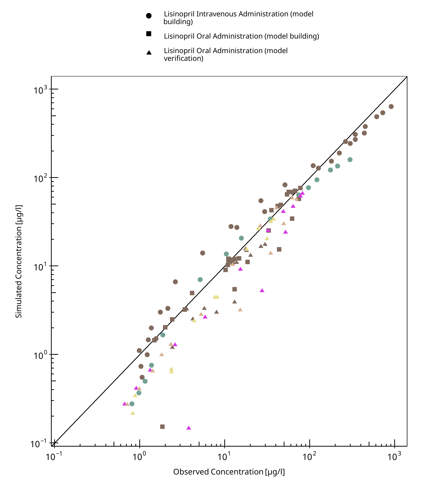
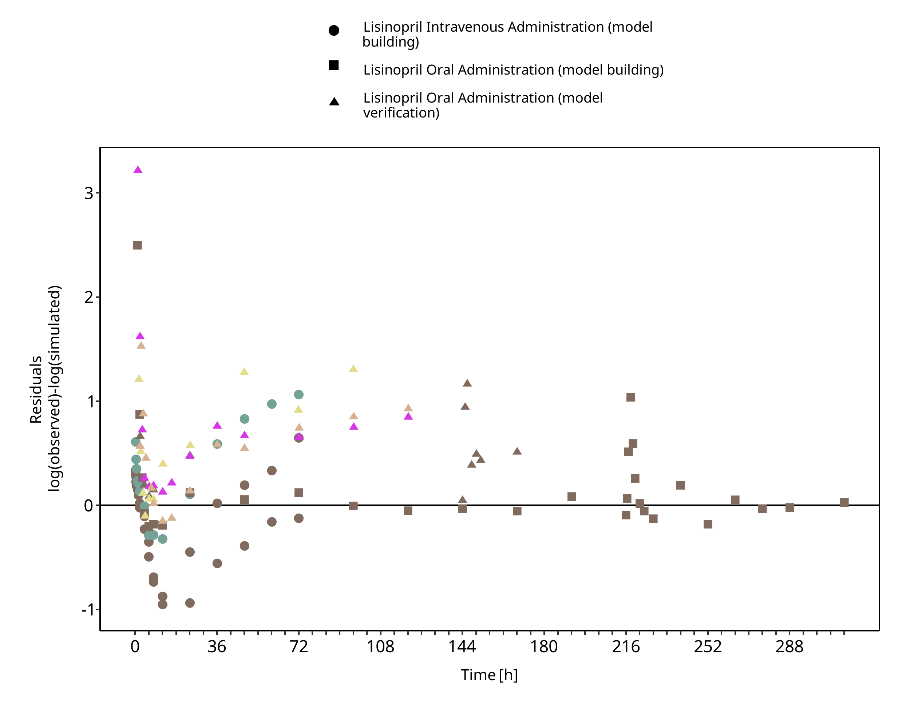
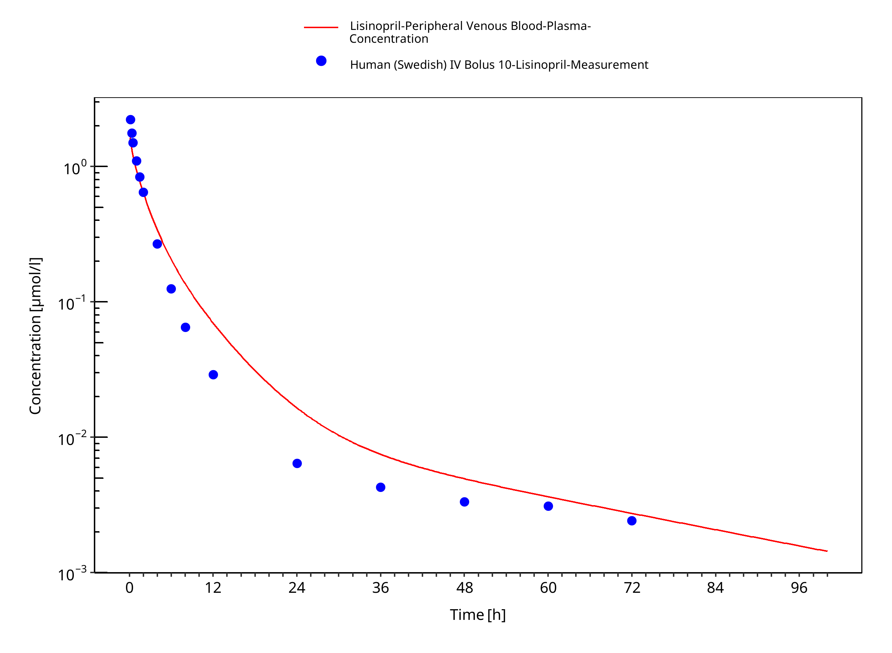
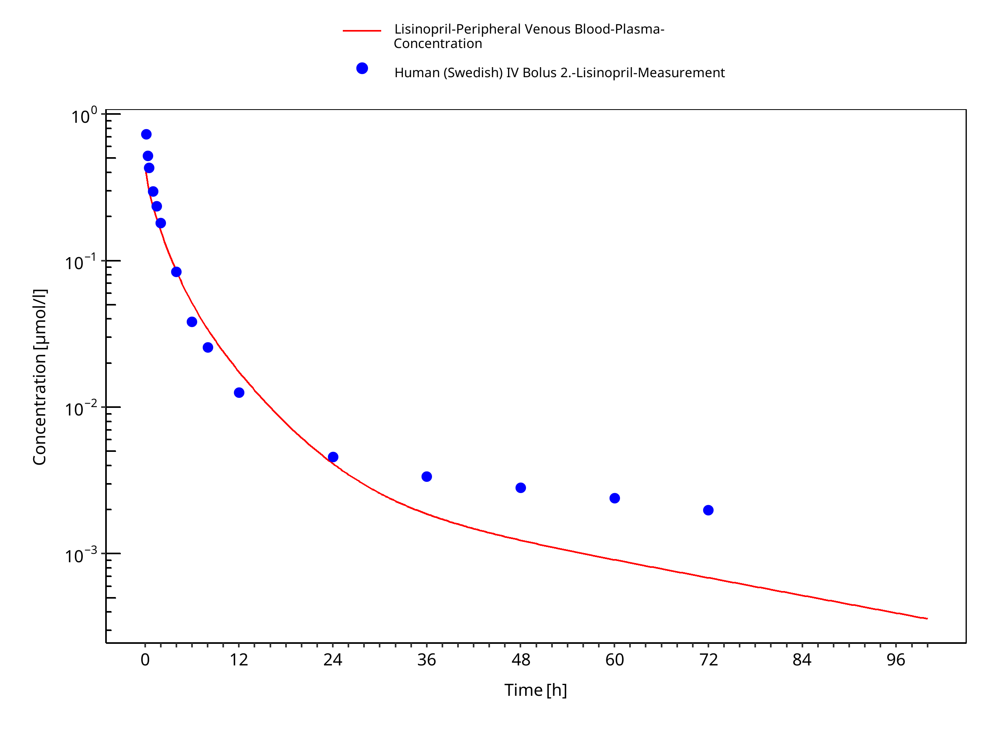
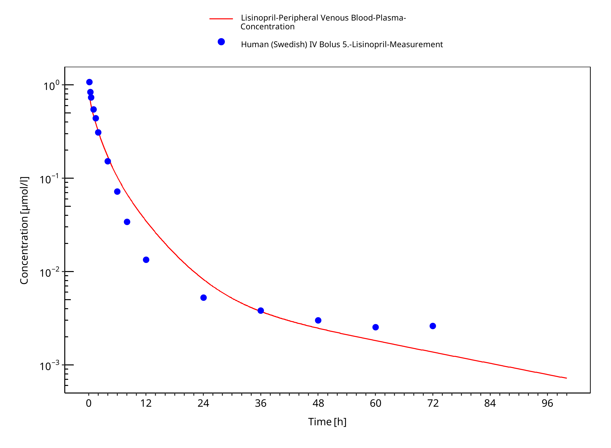
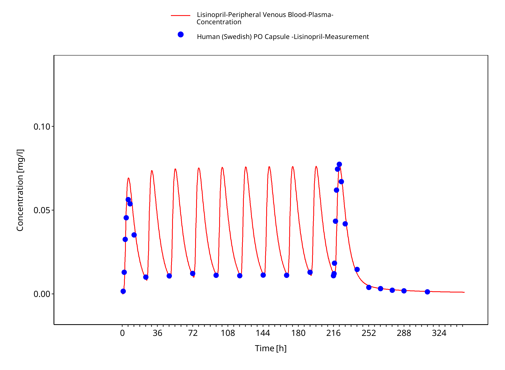
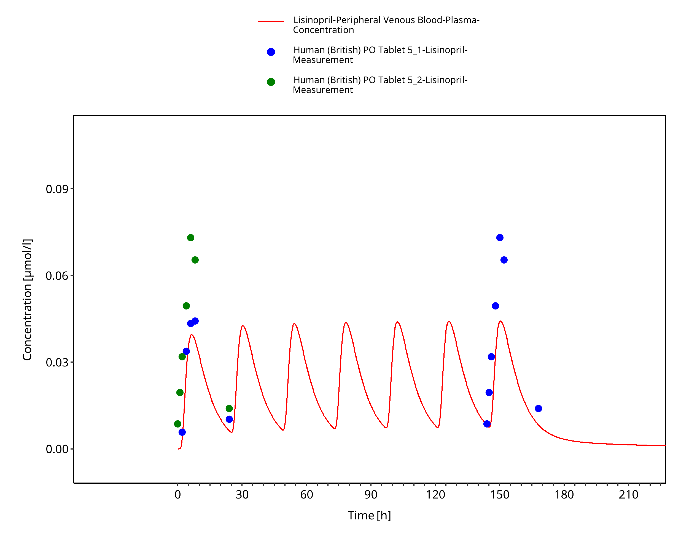
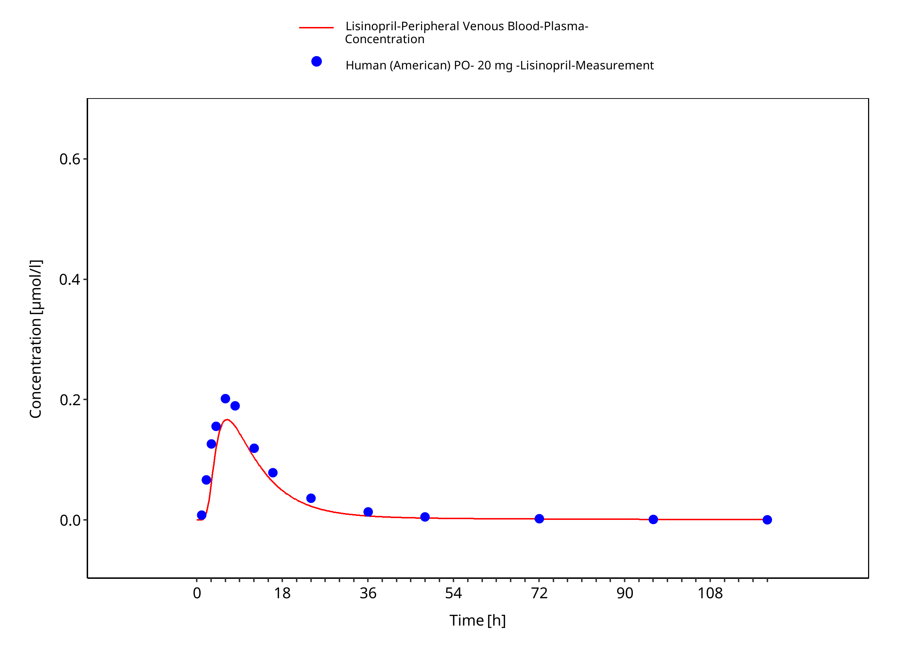
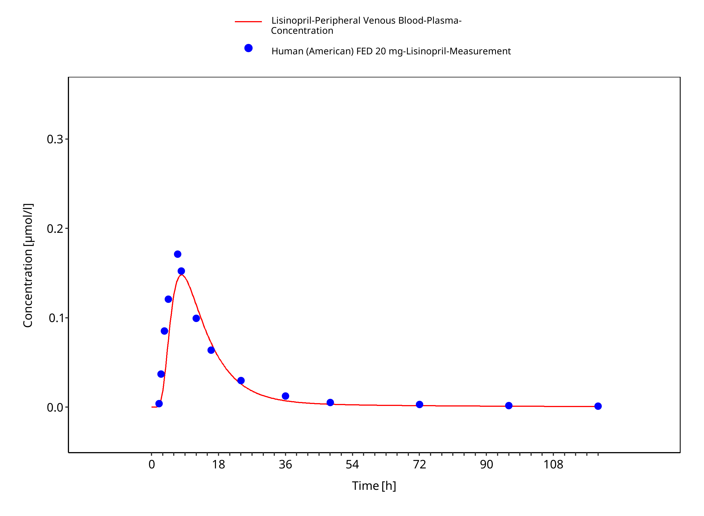
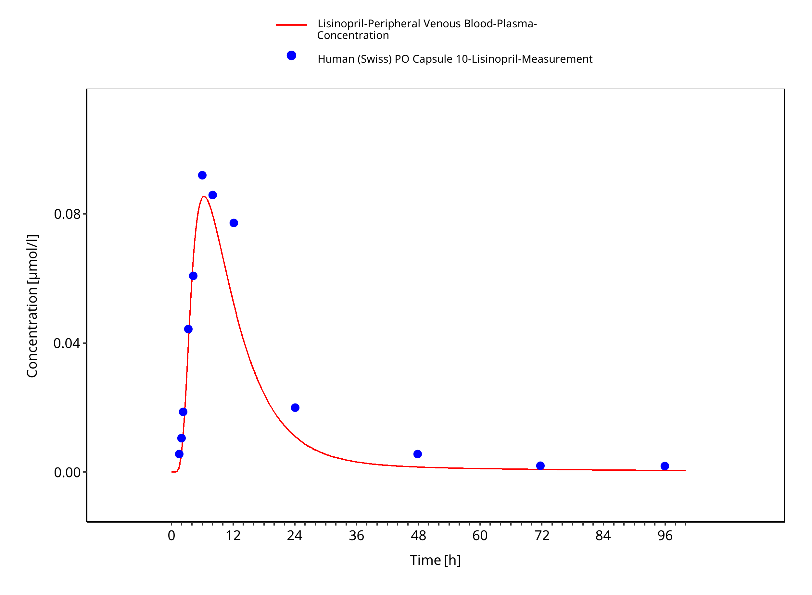

# Building and evaluation of a PBPK model for COMPOUND in healthy adults

| Version                                         | master-OSP12.1                                                   |
| ----------------------------------------------- | ------------------------------------------------------------ |
| based on *Model Snapshot* and *Evaluation Plan* | https://github.com/Open-Systems-Pharmacology/Lisinopril-Model/releases/tag/vmaster |
| OSP Version                                     | 12.1                                                          |
| Qualification Framework Version                 | 3.4                                                          |

This evaluation report and the corresponding PK-Sim project file are filed at:

https://github.com/Open-Systems-Pharmacology/OSP-PBPK-Model-Library/

# Table of Contents

 * [1 Introduction](#introduction)
 * [2 Methods](#methods)
   * [2.1 Modeling Strategy](#modeling-strategy)
   * [2.2 Data](#methods-data)
     * [2.2.1 In vitro / physico-chemical Data ](#invitro-and-physico-chemical-data)
     * [2.2.2 Clinical Data  ](#clinical-data)
       * [2.2.2.1 Model Building ](#model-building)
       * [2.2.2.2 Model Verification ](#model-verification)
   * [2.3 Model Parameters and Assumptions](#model-parameters-and-assumptions)
     * [2.3.1 Absorption ](#model-parameters-and-assumptions-absorption)
     * [2.3.2 Distribution ](#model-parameters-and-assumptions-distribution)
     * [2.3.3 Metabolism and Elimination ](#model-parameters-and-assumptions-metabolism-and-elimination)
     * [2.3.4 Automated Parameter Identification ](#model-parameters-and-assumptions-parameter-identification)
 * [3 Results and Discussion](#results-and-discussion)
   * [3.1 Final input parameters](#final-input-parameters)
   * [3.2 Diagnostics Plots](#diagnostics-plots)
   * [3.3 Concentration-Time Profiles](#ct-profiles)
 * [4 Conclusion](#conclusion)
 * [5 References](#main-references)

# 1 Introduction

The presented model building and evaluation report evaluates the performance of a PBPK model for Lisinopril in healthy adults.

Lisinopril is an oral, long-acting angiotensin-converting enzyme (ACE) inhibitor used for the treatment of hypertension and heart failure. 
It reduces blood pressure by inhibiting the conversion of angiotensin I to angiotensin II, leading to vasodilation and decreased aldosterone secretion. 
Unlike many ACE inhibitors, lisinopril is a hydrophilic compound that does not undergo hepatic metabolism and is excreted unchanged in the urine. 
Its absorption is moderate, with approximately 25% of the administered dose reaching systemic circulation, and peak plasma concentrations occurring 6-8 hours after oral administration. 
Food intake does not significantly affect its absorption.

Lisinopril follows a biphasic pharmacokinetic profile, with an initial distribution phase and a prolonged terminal phase, which reflects its strong binding to ACE rather than drug accumulation. 
Its elimination occurs primarily through renal excretion, with a consistent clearance profile across different doses. 
The drug has an effective accumulation half-life of approximately 12 hours, supporting once-daily dosing for sustained blood pressure control.

The herein presented model building and evaluation report evaluates the performance of the PBPK model for Lisinopril in healthy adults.

The presented Lisinopril PBPK model as well as the respective evaluation plan and evaluation report are provided open-source ([https://github.com/Open-Systems-Pharmacology/Lisinopril-model](https://github.com/Open-Systems-Pharmacology/Lisinopril-model)).

# 2 Methods

## 2.1 Modeling Strategy

The general concept of building a PBPK model has previously been described by Kuepfer et al. ([Kuepfer 2016](#main-references)) The relevant anthropometric (height, weight) and physiological parameters (e.g. blood flows, organ volumes, binding protein concentrations, hematocrit, cardiac output) in adults was gathered from the literature and has been previously published ([PK-Sim Ontogeny Database Version 7.3](#main-references)). The information was incorporated into PK-Sim® and was used as default values for the simulations in adults.

The applied activity and variability of plasma proteins and active processes that are integrated into PK-Sim® are described in the publicly available PK-Sim® Ontogeny Database Version 7.3 ([Schlender 2016](#main-references)) or otherwise referenced for the specific process.

First, a base mean model was built using clinical Phase I data including selected single dose studies with intravenous and oral applications of lisinopril to find an appropriate structure to describe the pharmacokinetics in plasma. The mean PBPK model was developed using a typical European individual. 

Unknown parameters were identified using the Parameter Identification module provided in PK-Sim®. Structural model selection was mainly guided by visual inspection of the resulting description of data and biological plausibility.

Once the appropriate structural model was identified, additional parameters for tablet formulations were identified. 

The model was then verified by simulating:

- Oral administration of lisinopril in fasted state
- Oral administration of lisinopril in fed state

Details about input data (physicochemical, *in vitro* and clinical) can be found in  [Section 2.2](#methods-data).

Details about the structural model and its parameters can be found in  [Section 2.3](#model-parameters-and-assumptions).

## 2.2 Data

### 2.2.1 In vitro / physico-chemical Data 

A literature search was performed to collect available information on physicochemical properties of lisinopril. The obtained information from literature is summarized in the table below. 

| **Parameter**   | **Unit** | **Value** | Source                                     | **Description**                                 |
| :-------------- | -------- | --------- | ------------------------------------------ | ----------------------------------------------- |
| MW              | g/mol    |405.49     | [PubChem 2024](#main-references)               | Molecular weight                                |
| pKa  |  -        | 1.63 (strongest acidic)          | [Takács-Novák 2003](#main-references)         | Acid dissociation constant                      |
| pKa  |   -       | 10.75 (strongest basic)          | [Takács-Novák 2003](#main-references)         | Acid dissociation constant                      |
| Solubility (pH) |  1 at pH7.2        |     mg/mL      | [Cayman Chem 2022](#main-references)               | Aqueous Solubility, FaSSIF, ...                 |
| fu              | %        |   100        | [DrugBank 2025](#main-references)                | Fraction unbound in plasma                      |

### 2.2.2 Clinical Data  

A literature search was performed to collect available clinical data on lisinopril in healthy adults.

#### 2.2.2.1 Model Building 

The following studies were used for model building (training data):

| **Dose [mg]** | **Dosing** | **PK data** |**Dataset**| **Reference** |
| --------------- | ------------------- | ----------------------- | ----------------- |----------------- |
| 2.64| iv, sd |plasma|training|[Beermann 1989](#5-references)| 
| 5.28| iv, sd |plasma|training|[Beermann 1989](#5-references)| 
| 10.56| iv, sd |plasma|training|[Beermann 1989](#5-references)| 
| 20| po, tab, fasted, qd |plasma|training|[Beermann 1989](#5-references)| 
iv = intravenous; po = oral administration; tab = tablet administration; sd = single dose; qd = once daily

#### 2.2.2.2 Model Verification 

The following studies were used for model verification:

| **Dose [mg]** | **Dosing** | **PK data** |**Dataset**| **Reference** |
| --------------- | ------------------- | ----------------------- | ----------------- |----------------- |
| 10| po, tab, fasted, sd |plasma|training|[Ulm 1982](#5-references)| 
| 5| po, tab, fasted, qd |plasma|training|[Gautam 1987](#5-references)| 
| 20| po, tab, fasted, sd |plasma|training|[Mojaverian 1986](#5-references)| 
| 20| po, tab, fed, sd |plasma|training|[Mojaverian 1986](#5-references)| 
iv = intravenous; po = oral administration; tab = tablet administration; sd = single dose; qd = once daily

## 2.3 Model Parameters and Assumptions

### 2.3.1 Absorption 

The parameters values for `Intestinal permeability` and `Permeability P(intracellular->interstitial) Mucosa` were optimized based on clinical oral data, see [Section 2.3.4](#model-parameters-and-assumptions-identification). 
The measured solubility of lisinopril was taken from Product information from Cayman Chemical Co (see [Section 2.2.1](#invitro-and-physico-chemical-data)).

Tablet dissolution was modeled using an empirical Weibull dissolution approach, with the corresponding parameters estimated (Dissolution time and shape).

### 2.3.2 Distribution 

Lisinopril does not bind to plasma proteins (fu = 100 %) (see [Section 2.2.1](#invitro-and-physico-chemical-data)) ([Beermann 1989](#main-references)). In this PBPK model, a value of 100% was assigned to `Fraction unbound (plasma, reference value)`.

An important parameter influencing the resulting volume of distribution is lipophilicity, which was also estimated. 

After testing the available organ-plasma partition coefficient and cell permeability calculation methods built in PK-Sim®, observed clinical data was best described by choosing the partition coefficient calculation by `Schmitt` and cellular permeability calculation by `Charged dependent Schmitt`.

### 2.3.3 Metabolism and Elimination 

After absorption, Lisinopril remains unbound to plasma proteins, does not undergo metabolism, and is not secreted into bile. The drug is primarily eliminated through renal plasma clearance, with `Plasma Clearance` estimated accordingly.

### 2.3.4 Automated Parameter Identification 

This is the result of the final parameter identification.

| Model Parameter      | Optimized Value | Unit |
| -------------------- | --------------- | ---- |
| `lipophilicity` |          -0.58       |   Log Units   |
| `Plasma Clearance (Renal clearance)` |        1.18         |      |ml/min/kg
| `Intestinal permeability` |     1.35E-8            | cm/s     |
| `Weibull Dissolution time` |        120         |  min    |
| `Weibull Dissolution shape` |        3.00         |   -   |
| `Permeability P(intracellular->interstitial) Mucosa (large intestine)` |        8.1132E-6         |   cm/min   |
| `Permeability P(intracellular->interstitial) Mucosa (small intestine)`  |        3E-09         |   cm/min   |

# 3 Results and Discussion

The PBPK model for Lisinopril was developed and verified with clinical pharmacokinetic data.

The model was evaluated covering data from studies including in particular

* Intravenous Bolus
* Oral administration over fed and fasted states.

The next sections show:

1. the final model parameters for the building blocks: [Section 3.1](#final-input-parameters).
2. the overall goodness of fit: [Section 3.2](#diagnostics-plots).
3. simulated vs. observed concentration-time profiles for the clinical studies used for model building and for model verification: [Section 3.3](#ct-profiles).

## 3.1 Final input parameters

The compound parameter values of the final PBPK model are illustrated below.

### Compound: Lisinopril

#### Parameters

Name                                       | Value                   | Value Origin                                                                                                          | Alternative | Default
------------------------------------------ | ----------------------- | --------------------------------------------------------------------------------------------------------------------- | ----------- | -------
Solubility at reference pH                 | 1000 mg/l               |                                                                                                                       | Measurement | True   
Reference pH                               | 7.2                     |                                                                                                                       | Measurement | True   
Lipophilicity                              | -0.5781319594 Log Units | Parameter Identification-Parameter Identification-Value updated from 'Parameter Identification 4' on 2025-01-23 23:53 | Measurement | True   
Fraction unbound (plasma, reference value) | 1                       |                                                                                                                       | Measurement | True   
Is small molecule                          | Yes                     |                                                                                                                       |             |        
Molecular weight                           | 405.5 g/mol             |                                                                                                                       |             |        
Plasma protein binding partner             | Albumin                 |                                                                                                                       |             |        

#### Calculation methods

Name                    | Value                   
----------------------- | ------------------------
Partition coefficients  | Schmitt                 
Cellular permeabilities | Charge dependent Schmitt

#### Processes

##### Systemic Process: Renal Clearances-Renal Clearance

Species: Human

###### Parameters

Name                          | Value          | Value Origin                                                                                                         
----------------------------- | -------------- | ---------------------------------------------------------------------------------------------------------------------
Fraction unbound (experiment) | 1              |                                                                                                                      
Plasma clearance              | 1.18 ml/min/kg | Parameter Identification-Parameter Identification-Value updated from 'Parameter Identification 4' on 2025-01-23 23:53

## 3.2 Diagnostics Plots

Below you find the goodness-of-fit visual diagnostic plots for the PBPK model performance of all data used presented in [Section 2.2.2](#clinical-data).

The first plot shows observed versus simulated plasma concentration, the second weighted residuals versus time. 

**Table 3-1: GMFE for Goodness of fit plot for concentration in plasma**

|Group                                                  |GMFE |
|:------------------------------------------------------|:----|
|Lisinopril Intravenous Administration (model building) |1.46 |
|Lisinopril Oral Administration (model building)        |1.31 |
|Lisinopril Oral Administration (model verification)    |1.84 |
|All                                                    |1.56 |

 
 

**Figure 3-1: Goodness of fit plot for concentration in plasma**

 
 

**Figure 3-2: Goodness of fit plot for concentration in plasma**

 
 

## 3.3 Concentration-Time Profiles

Simulated versus observed concentration-time profiles of all data listed in [Section 2.2.2](#clinical-data) are presented below.

**Figure 3-3: Lisinopril - IV, Beermann Bolus 10.56mg**

 
 

**Figure 3-4: Lisinopril - IV, Beermann Bolus 2.24mg**

 
 

**Figure 3-5: Lisinopril - IV, Beermann Bolus 5.28mg**

 
 

**Figure 3-6: Lisinopril - PO, Beermann repeated 20mg**

 
 

**Figure 3-7: Lisinopril - PO, Gautam 5mg**

 
 

**Figure 3-8: Lisinopril - PO, Mojaverian fasted 20mg**

 
 

**Figure 3-9: Lisinopril - PO, Mojaverian fed 20mg**

 
 

**Figure 3-10: Lisinopril - PO, Ulm fed 10mg**

 
 

# 4 Conclusion

The herein presented PBPK model adequately describes the pharmacokinetics of Lisinopril in adults.

# 5 References

**Beermann 1989** Beermann B, Till A E, Gomez H J, Hichens M, Bolognese J A, Junggren I. Pharmacokinetics of lisinopril (IV/PO) in healthy volunteers.Biopharmaceutics & Drug Disposition.  1989 Jul-Aug;10(4):397-409. doi: 10.1002/bdd.2510100407. 	

**Ulm 1982** Ulm EH, Hichens M, Gomez HJ, Till AE, Hand E, Vassil TC, Biollaz J, Brunner HR, Schelling JL. Enalapril maleate and a lysine analogue (MK-521): disposition in man. Br J Clin Pharmacol. 1982 Sep;14(3):357-62. doi: 10.1111/j.1365-2125.1982.tb01991.x.

**Gautam 1987** Gautam PC, Vargas E, Lye M. Pharmacokinetics of lisinopril (MK521) in healthy young and elderly subjects and in elderly patients with cardiac failure. J Pharm Pharmacol. 1987 Nov;39(11):929-31. doi: 10.1111/j.2042-7158.1987.tb03130.x.

**Mojaverian 1986** Mojaverian P, Rocci ML Jr, Vlasses PH, Hoholick C, Clementi RA, Ferguson RK. Effect of food on the bioavailability of lisinopril, a nonsulfhydryl angiotensin-converting enzyme inhibitor. J Pharm Sci. 1986 Apr;75(4):395-7. doi: 10.1002/jps.2600750416.	

**Rashid 2020** Rashid M, Sarfraz M, Arafat M, Hussain A, Abbas N, Sadiq MW, Rasool MF, Bukhari NI. Prediction of lisinopril pediatric dose from the reference adult dose by employing a physiologically based pharmacokinetic model. BMC Pharmacol Toxicol. 2020 Jul 29;21(1):56. doi: 10.1186/s40360-020-00429-y. 

**Xie 2021** Xie F, Van Bocxlaer J, Vermeulen A. Physiologically based pharmacokinetic modelling of lisinopril in children: A case story of angiotensin converting enzyme inhibitors. Br J Clin Pharmacol. 2021 Mar;87(3):1203-1214. doi: 10.1111/bcp.14492.

**Takács-Novák 2003** Takács-Novák K, Deák K, Béni S, Völgyi G. Physico-chemical Profiling of the ACE-inhibitor Lisinopril: Acid-base Properties. ADMET and DMPK. 2023;1(2):6-16. doi: 10.5599/admet.1.1.3.

**PubChem 2024** PubChem Compound Summary of Lisinopril (2024). https://pubchem.ncbi.nlm.nih.gov/compound/Lisinopril

**Cayman Chem 2022** Product information from Cayman Chemical Co (2022) https://www.caymanchem.com/product/16833/lisinopril

**DrugBank 2025** Durgbank Compound Summary of Lisinopril (2025). https://go.drugbank.com/drugs/DB00722

