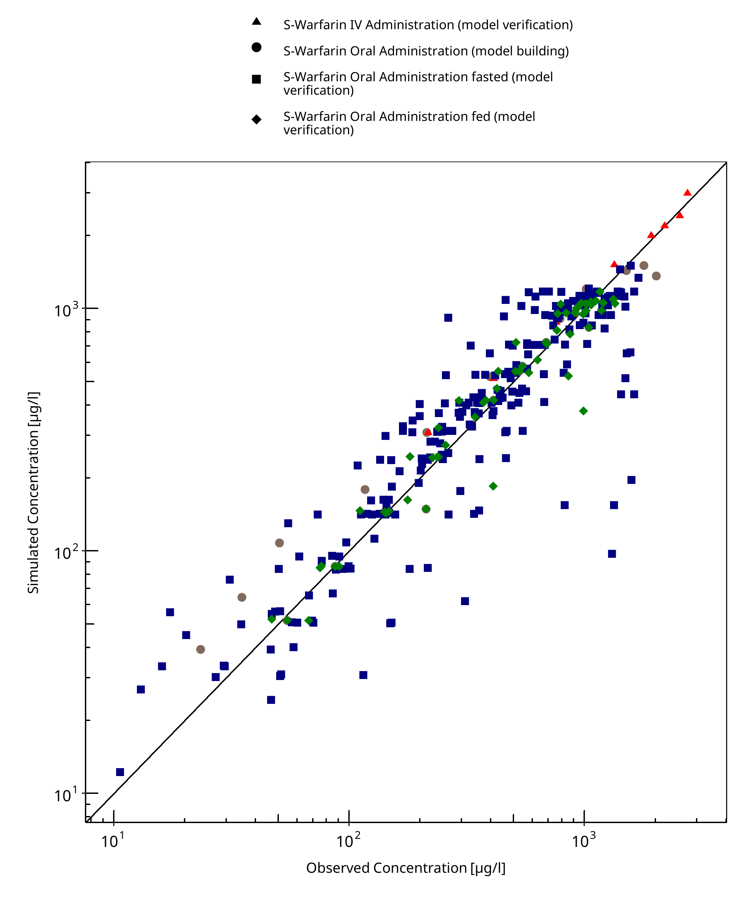
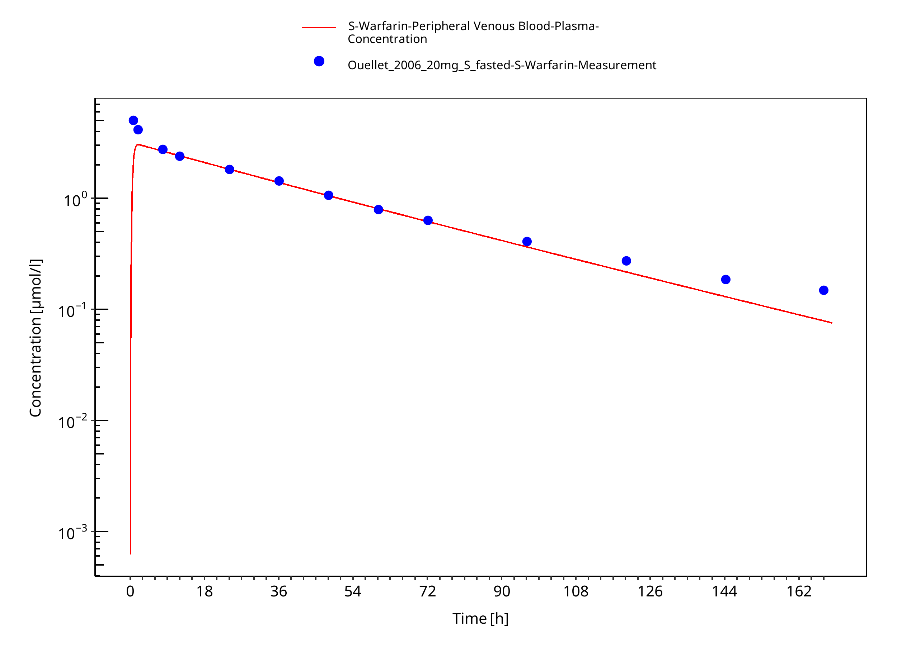

# Building and evaluation of a PBPK model for Warfarin in healthy adults

| Version                                         | main-OSP12.1                                                   |
| ----------------------------------------------- | ------------------------------------------------------------ |
| based on *Model Snapshot* and *Evaluation Plan* | https://github.com/Open-Systems-Pharmacology/Warfarin-Model/releases/tag/vmain |
| OSP Version                                     | 12.1                                                          |
| Qualification Framework Version                 | 3.4                                                          |

This evaluation report and the corresponding PK-Sim project file are filed at:

https://github.com/Open-Systems-Pharmacology/OSP-PBPK-Model-Library/

# Table of Contents

 * [1 Introduction](#introduction)
 * [2 Methods](#methods)
   * [2.1 Modeling Strategy](#modeling-strategy)
   * [2.2 Data](#methods-data)
     * [2.2.1 In vitro / physico-chemical Data ](#invitro-and-physico-chemical-data)
     * [2.2.2 Clinical Data  ](#clinical-data)
       * [2.2.2.1 Model Building S-Warfarin ](#model-building)
       * [2.2.2.2 Model Verification S- Warfarin ](#model-verification)
       * [2.2.2.3 Model Verification R- Warfarin ](#model-verification)
   * [2.3 Model Parameters and Assumptions](#model-parameters-and-assumptions)
     * [2.3.1 Absorption ](#model-parameters-and-assumptions-absorption)
     * [2.3.2 Distribution ](#model-parameters-and-assumptions-distribution)
     * [2.3.3 Metabolism and Elimination ](#model-parameters-and-assumptions-metabolism-and-elimination)
     * [2.3.4 Automated Parameter Identification ](#model-parameters-and-assumptions-parameter-identification)
 * [3 Results and Discussion](#results-and-discussion)
   * [3.1 Final input parameters](#final-input-parameters)
   * [3.2 Diagnostics Plots S-warfarin](#diagnostics-plots-s-warfarin)
   * [3.3 Diagnostics Plots R-warfarin](#diagnostics-plots-r-warfarin)
   * [3.4 Concentration-Time Profiles](#ct-profiles)
 * [4 Conclusion](#conclusion)
 * [5 References](#main-references)

# 1 Introduction

The presented model building and evaluation report evaluates the performance of a PBPK model for Warfarin in healthy adults.

Warfarin is a widely used oral anticoagulant that exerts its therapeutic effect by inhibiting the hepatic synthesis of vitamin K–dependent clotting factors. Warfarin therapy requires careful monitoring because of its narrow therapeutic index and the risk of bleeding [Uygungül 2014](#main-references). 

Warfarin is classified as a BCS Class I drug, which means it has high solubility and high permeability. This classification indicates that warfarin is expected to dissolve rapidly and be well absorbed in the gastrointestinal tract [Kim 2019](#main-references). 

Warfarin is administered as a racemic mixture of two enantiomers, S-warfarin and R-warfarin, which differ in both potency and metabolism. The S-enantiomer is approximately two- to five-fold more potent as an anticoagulant compared to the R-enantiomer, but it is cleared more rapidly [Maddison 2013](#main-references), [Geng 2024](#main-references). The two enantiomers are metabolized by different cytochrome P450 isoforms. S-warfarin is primarily cleared by CYP2C9 with additional contribution from CYP3A4 and reduction to alcohols, while R-warfarin is metabolized mainly by CYP1A2, CYP2C19, and CYP3A4, as well as reduction to alcohol. Renal elimination of the unchanged parent drug is small for both enantiomers [Wittkowsky 2003](#main-references).

The herein presented model building and evaluation report evaluates the performance of the PBPK model for S-Warfarin and R-Warfarin in healthy adults. Both enantiomers are modeled separately. These models integrate physicochemical properties, binding characteristics, distribution, and the known stereospecific clearance pathways of each enantiomer. The performance of the models is evaluated against published clinical data for different dosing regimens under fasted and fed conditions.

The presented Warfarin PBPK model as well as the respective evaluation plan and evaluation report are provided open-source ([https://github.com/Open-Systems-Pharmacology/Warfarin-model](https://github.com/Open-Systems-Pharmacology/Warfarin-model)).

# 2 Methods

## 2.1 Modeling Strategy

The general concept of building a PBPK model has previously been described by Kuepfer et al. ([Kuepfer 2016](#main-references)) The relevant anthropometric (height, weight) and physiological parameters (e.g. blood flows, organ volumes, binding protein concentrations, hematocrit, cardiac output) in adults was gathered from the literature and has been previously published ([PK-Sim Ontogeny Database Version 7.3](#main-references)). The information was incorporated into PK-Sim® and was used as default values for the simulations in adults.

The applied activity and variability of plasma proteins and active processes that are integrated into PK-Sim® are described in the publicly available PK-Sim® Ontogeny Database Version 7.3 ([Schlender 2016](#main-references)) or otherwise referenced for the specific process.

First, a base mean model was built using clinical Phase I data including selected single dose studies with intravenous and oral applications of Warfarin to find an appropriate structure to describe the pharmacokinetics in plasma. The mean PBPK model was developed using a typical European individual. 

Unknown parameters were identified using the Parameter Identification module provided in PK-Sim®. Structural model selection was mainly guided by visual inspection of the resulting description of data and biological plausibility.

Once the appropriate structural model was identified, additional parameters for tablet formulations were identified. 

The model was then verified by simulating:

- Oral administration of Warfarin in fasted state
- Oral administration of Warfarin in fed state
- Intravenous administration of Warfarin

Details about input data (physicochemical, *in vitro* and clinical) can be found in  [Section 2.2](#methods-data).

Details about the structural model and its parameters can be found in  [Section 2.3](#model-parameters-and-assumptions).

## 2.2 Data

### 2.2.1 In vitro / physico-chemical Data 

A literature search was performed to collect available information on physicochemical properties of Warfarin . The obtained information from literature is summarized in the table below. 

**Physicochemical and binding properties**

| **Parameter** | **Unit** | **Value** | **Source** | **Description** |
|:--------------|:---------|----------:|:-----------|:----------------|
| MW            | g/mol    | 308.33    | 	[Drugbank](#main-references)          | Molecular weight |
| pKa | –        | 5.03 (acid) | [Drugbank](#main-references) | Acid dissociation constant |
| Solubility     | mg/L     | 17 (at pH 7) | [Drugbank](#main-references) | Aqueous solubility |
| fuplasma |   | 0.009     |[Takahashi 2003](#main-references)| Fraction unbound in plasma (albumin binding) |
| LogP          | –        | 3.46      |[Avdeef 1998](#main-references)|  Liposomal membrane-water partition coefficient |
| B/P           | –        | 0.55      | —          | Blood-to-plasma ratio (used in reduction pathway) |

**S-warfarin - Metabolic and clearance parameters**

| **Pathway / Enzyme** | **Parameter** | **Unit** | **Value** | **Source / Note** |
|:---------------------|:--------------|:---------|----------:|:------------------|
| CYP2C9               | Km            | µM       | 4.4       | Experimental Km within range 3.5 to 5.54 µM [Shaik 2016](#main-references),[Rettie 1992](#main-references), [Rettie 1992](#main-references), [Yong 2009](#main-references), [Crewe 2011](#main-references)|
| CYP3A4               | Km            | µM       | 14.9      | Experimental Km within range 14 to 27 [Shaik 2016](#main-references), [Jones 2010](#main-references)  |
| Reduction to alcohols| Plasma CL Specific CL   | ml/min/kg 1/min    | 0.14 0.02     | Metabolism reduction mediated by aldo-keto reductases (i.e., fraction metabolized ~ 10%) [Wittkowsky 2003](#main-references)|
| Renal clearance| Plasma CL Specific CL| l/h/kg 1/min| 0.07 0.02|   Consistent with fraction excreted in urine ~ 1% [FDA 2010](#main-references) |

**R-warfarin - Metabolic and clearance parameters**

| **Pathway / Enzyme** | **Parameter** | **Unit** | **Value** | **Source / Note** |
|:---------------------|:--------------|:---------|----------:|:------------------|
| CYP1A2               | Km            | µM       | 648       | Adopted from previous PK-Sim model |
| CYP2C19              | Km            | µM       | 391       | Adopted from previous PK-Sim model |
| CYP3A4               | Km            | µM       | 586       | Adopted from previous PK-Sim model |
| Reduction to alcohols| Plasma CL Specific CL | ml/h/kg 1/min    | 0.27 0.02|  
| Renal clearance      |  Plasma CL Specific CL | ml/h/kg 1/min | 0.07 0.02     |   

### 2.2.2 Clinical Data  

A literature search was performed to collect available clinical data on Warfarin in healthy adults.

#### 2.2.2.1 Model Building S-Warfarin 

The following studies were used for model building (training data):

| **Dose [mg]** | **Dosing** | **PK data** |**Dataset**| **Reference** |
| --------------- | ------------------- | ----------------------- | ----------------- |----------------- |
| 15| po, sd |plasma|training|[Soon 2006](#main-references)| 
| 25| po, sd |plasma|training|[Schwartz 2008](#main-references)| 

iv = intravenous; po = oral administration; tab = tablet administration; sd = single dose; qd = once daily

#### 2.2.2.2 Model Verification S- Warfarin 

The following studies were used for model verification:

| **Dose [mg]** | **Dosing** | **PK data** |**Dataset**| **Reference** |
| --------------- | ------------------- | ----------------------- | ----------------- |----------------- |
| 0.375| iv, tab, fasted, sd |plasma|verification|[O'Sullivan 1993](#main-references)| 
| 7.5| po, tab, fasted with meal administration 3h post-dose, sd |plasma|verification|[Frymoyer 2010](#main-references)| 
| 10| po, tab, fasted, sd |plasma|verification|[Kim 2001](#main-references)| 
| 10| po, tab, fasted, sd |plasma|verification|[Lilja 2007](#main-references)| 
| 10| po, tab, fasted, sd |plasma|verification|[Ngo 2010](#main-references)| 
| 10| po, tab, fasted, sd |plasma|verification|[Turpeinen 2013](#main-references)| 
| 13| po, tab, fed, sd |plasma|verification|[Weber 1999](#main-references)|
| 15| po, tab, fasted, sd |plasma|verification|[Schwartz 2009](#main-references)| 
| 20| po, tab, fasted, sd |plasma|verification|[Ouellet 2006](#main-references)| 
| 25| po, tab, fasted, sd |plasma|verification|[Almeida 2008](#main-references)| 
| 25| po, tab, fasted, sd |plasma|verification|[Dingemanse 2013](#main-references)| 
| 25| po, tab, fasted, sd |plasma|verification|[He 2007](#main-references)| 
| 25| po, tab, fasted, sd |plasma|verification|[Macha 2013](#main-references)| 
| 25| po, tab, fasted, sd |plasma|verification|[Malhotra 2011](#main-references)| 
| 25| po, tab, fasted, sd |plasma|verification|[Rahimy 2002](#main-references)| 
| 25| po, tab, fasted, sd |plasma|verification|[Sanwald Ducray 2014](#main-references)| 
| 25| po, tab, fasted, sd |plasma|verification|[Stockis 2013](#main-references)| 
| 25| po, tab, fasted, sd |plasma|verification|[Toon 1987](#main-references)| 
| 25| po, tab, fasted, sd |plasma|verification|[Toon 1990](#main-references)| 
| 25| po, tab, fed, sd |plasma|verification|[Mallikaarjun 1999](#main-references)| 
| 25| po, tab, fed, sd |plasma|verification|[Sidharta 2014](#main-references)| 
| 25| po, tab, fed, sd |plasma|verification|[Soon 2006](#main-references)| 
| 25| po, tab, fed, sd |plasma|verification|[Yin 2011](#main-references)| 
| 30| po, tab, fasted with meal administration 4h post-dose, sd |plasma|verification|[Liao 1996](#main-references)| 

iv = intravenous; po = oral administration; tab = tablet administration; sd = single dose; qd = once daily

#### 2.2.2.3 Model Verification R- Warfarin 

The following studies were used for model verification:

| **Dose [mg]** | **Dosing** | **PK data** |**Dataset**| **Reference** |
| --------------- | ------------------- | ----------------------- | ----------------- |----------------- |
<<<<<<< HEAD
| 25| po, tab, fasted, sd |plasma|verification|[Almeida 2008](#main-references)| 
| 25| po, tab, fasted, sd |plasma|verification|[Dingemande 2013](#5-references)| 
| 25| po, tab, fasted, sd |plasma|verification|[He 2007](#main-references)| 
| 25| po, tab, fasted, sd |plasma|verification|[Malhotra 2011](#main-references)| 
| 25| po, tab, fasted, sd |plasma|verification|[Rahimy 2002](#main-references)| 
| 25| po, tab, fasted, sd |plasma|verification|[Stockis 2013](#main-references)| 
| 25| po, tab, fasted, sd |plasma|verification|[Toon 2087](#main-references)| 
| 25| po, tab, fasted, sd |plasma|verification|[Toon 1990](#main-references)| 
| 25| po, tab, fed, sd |plasma|verification|[Mallikaarjun 1999](#main-references)| 
| 25| po, tab, fed, sd |plasma|verification|[Sidharta 2014](#main-references)| 
| 25| po, tab, fed, sd |plasma|verification|[Soon 2006](#main-references)| 
| 25| po, tab, fed, sd |plasma|verification|[Yin 2011](#main-references)| 
=======
| 25| po, tab, fasted, sd |plasma|verification|[Almeida 2008](#5-references)| 
| 25| po, tab, fasted, sd |plasma|verification|[Dingemanse 2013](#5-references)| 
| 25| po, tab, fasted, sd |plasma|verification|[He 2007](#5-references)| 
| 25| po, tab, fasted, sd |plasma|verification|[Malhotra 2011](#5-references)| 
| 25| po, tab, fasted, sd |plasma|verification|[Rahimy 2002](#5-references)| 
| 25| po, tab, fasted, sd |plasma|verification|[Stockis 2013](#5-references)| 
| 25| po, tab, fasted, sd |plasma|verification|[Toon 1987](#5-references)| 
| 25| po, tab, fasted, sd |plasma|verification|[Toon 1990](#5-references)| 
| 25| po, tab, fed, sd |plasma|verification|[Mallikaarjun 1999](#5-references)| 
| 25| po, tab, fed, sd |plasma|verification|[Sidharta 2014](#5-references)| 
| 25| po, tab, fed, sd |plasma|verification|[Soon 2006](#5-references)| 
| 25| po, tab, fed, sd |plasma|verification|[Yin 2011](#5-references)| 
>>>>>>> c4bac1efd21d652db42ed9b81ab341fed3579aca

iv = intravenous; po = oral administration; tab = tablet administration; sd = single dose; qd = once daily

## 2.3 Model Parameters and Assumptions

### 2.3.1 Absorption 

The measured solubility of Warfarin was taken from Product information from [Drugbank](#main-references) (see [Section 2.2.1](#invitro-and-physico-chemical-data)).

Tablet dissolution was modeled using an empirical Weibull dissolution approach. Both enantiomer share the same absorption processes.

### 2.3.2 Distribution 

After testing the available organ-plasma partition coefficient and cell permeability calculation methods built in PK-Sim®, observed clinical data was best described by choosing the partition coefficient calculation by `Rodgers and Rowland` and cellular permeability calculation by `Charged dependent Schmitt`.

### 2.3.3 Metabolism and Elimination 

Clearance of warfarin was described through enzymatic and reductive pathways, with only a negligible contribution from renal excretion of unchanged parent drug. The stereospecific nature of warfarin metabolism was explicitly represented by modeling the two enantiomers separately, with different sets of enzymes responsible for their elimination.

For **S-warfarin**, metabolism is dominated by CYP2C9, which is the principal enzyme responsible for oxidative clearance. 
A smaller contribution from CYP3A4 was also included, together accounting for the observed in-vivo clearance. 
In addition, a reductive pathway leading to alcohol metabolites was implemented, using literature-based plasma clearance values and a blood-to-plasma ratio of 0.55 [Wittkowsky 2003](#5-references), leading to a hepatic `Specific Clearance` of 0.02 1/min. 
The renal elimination of unchanged S-warfarin was parameterized but remains negligible, consistent with clinical evidence of ~ 1% fraction excreted in urine [FDA 2010](#main-references). 
Kinetic constants for CYP2C9 and CYP3A4 were taken from in-vitro studies and the associated `Kcat` were optimized within the current model to achieve agreement with observed plasma concentrations. These optimized values reflect the dominant role of CYP2C9 and the minor but non-negligible contribution of CYP3A4 to the overall clearance of the S-enantiomer.

The clearance of **R-warfarin** was represented by three oxidative enzymes—CYP1A2, CYP2C19, and CYP3A4—together with the same reductive alcohol pathway and minor renal clearance. 
Experimental information on kinetic constants for R-warfarin is less abundant, and therefore the Km and Vmax values were adopted from a previously developed PBPK model in PK-Sim. The values for the Michaelis–Menten constants are relatively high (Km values of 648 µM for CYP1A2, 391 µM for CYP2C19, and 586 µM for CYP3A4), which indicates a low affinity of these enzymes for R-warfarin. The reduction to alcohols and renal clearance contribute only marginally to the overall disposition of the R-enantiomer.

### 2.3.4 Automated Parameter Identification 

This is the result of the final parameter identification.

| Model Parameter      | Optimized Value | Unit |
| -------------------- | --------------- | ---- |
| `Intestinal permeability (transcellular)` |0.0015|cm/min|
| `S-Warfarin CYP2C9 kcat` |0.2|1/min|
| `S-warfarin CYP3A4 kcat` |0.09|1/min|

# 3 Results and Discussion

The PBPK model for Warfarin, was developed and verified with clinical pharmacokinetic data.

The model was evaluated covering data from studies including in particular

* Intravenous Bolus
* Oral administration over fasted and fed states.

The next sections show:

1. the final model parameters for the building blocks: [Section 3.1](#final-input-parameters).
2. the overall goodness of fit: [Section 3.2](#diagnostics-plots).
3. simulated vs. observed concentration-time profiles for the clinical studies used for model building and for model verification: [Section 3.3](#ct-profiles).

## 3.1 Final input parameters

The compound parameter values of the final PBPK model are illustrated below.

### Compound: S-Warfarin

#### Parameters

Name                                             | Value          | Value Origin                               | Alternative | Default
------------------------------------------------ | -------------- | ------------------------------------------ | ----------- | -------
Solubility at reference pH                       | 17 mg/l        | Internet-DrugBank (Tomlin 1997)            | Measurement | True   
Reference pH                                     | 7              | Internet-DrugBank (Tomlin 1997)            | Measurement | True   
Lipophilicity                                    | 3.46 Log Units | Publication-logP_mem_neutral (Avdeef 1998) | Measurement | True   
Fraction unbound (plasma, reference value)       | 0.009          | Publication-Takahashi 2003                 | Measurement | True   
Specific intestinal permeability (transcellular) | 0.0015 cm/min  |                                            | fitted      | True   
Is small molecule                                | Yes            |                                            |             |        
Molecular weight                                 | 308.33 g/mol   |                                            |             |        
Plasma protein binding partner                   | Albumin        |                                            |             |        

#### Calculation methods

Name                    | Value                   
----------------------- | ------------------------
Partition coefficients  | Rodgers and Rowland     
Cellular permeabilities | Charge dependent Schmitt

#### Processes

##### Systemic Process: Renal Clearances-Urine excretion data (Heimark, Toon, O'Reilly)

Species: Human

###### Parameters

Name                          | Value        | Value Origin
----------------------------- | ------------ | ------------
Fraction unbound (experiment) | 0.009        |             
Plasma clearance              | 0.07 ml/h/kg |             
Specific clearance            | 0.02 1/min   | Unknown     

##### Metabolizing Enzyme: CYP2C9-HLM Mean

Molecule: CYP2C9

###### Parameters

Name                                        | Value                        | Value Origin                                                                                                       
------------------------------------------- | ---------------------------- | -------------------------------------------------------------------------------------------------------------------
In vitro Vmax for liver microsomes          | 6.9 pmol/min/mg mic. protein |                                                                                                                    
Content of CYP proteins in liver microsomes | 96 pmol/mg mic. protein      | Unknown                                                                                                            
Km                                          | 4.4 µmol/l                   |                                                                                                                    
kcat                                        | 0.2022708099 1/min           | Parameter Identification-Parameter Identification-Value updated from 'Parameter Identification' on 2025-08-01 11:48

##### Systemic Process: Total Hepatic Clearance-Reduction to alcohool

Species: Human

###### Parameters

Name                             | Value          | Value Origin
-------------------------------- | -------------- | ------------
Fraction unbound (experiment)    | 0.009          |             
Lipophilicity (experiment)       | 3.46 Log Units |             
Blood/Plasma concentration ratio | 0.55           | Unknown     
Plasma clearance                 | 0.14 ml/min/kg |             
Specific clearance               | 0.02 1/min     | Unknown     

##### Metabolizing Enzyme: CYP3A4-HLM mean

Molecule: CYP3A4

###### Parameters

Name                 | Value              | Value Origin                                                                                                       
-------------------- | ------------------ | -------------------------------------------------------------------------------------------------------------------
Enzyme concentration | 1 µmol/l           |                                                                                                                    
Vmax                 | 0 µmol/l/min       |                                                                                                                    
Km                   | 14.9 µmol/l        |                                                                                                                    
kcat                 | 0.0872168808 1/min | Parameter Identification-Parameter Identification-Value updated from 'Parameter Identification' on 2025-08-01 11:48

### Compound: R-Warfarin

#### Parameters

Name                                             | Value          | Value Origin                               | Alternative | Default
------------------------------------------------ | -------------- | ------------------------------------------ | ----------- | -------
Solubility at reference pH                       | 17 mg/l        | Internet-DrugBank (Tomlin 1997)            | Measurement | True   
Reference pH                                     | 7              | Internet-DrugBank (Tomlin 1997)            | Measurement | True   
Lipophilicity                                    | 3.46 Log Units | Publication-logP_mem_neutral (Avdeef 1998) | Measurement | True   
Fraction unbound (plasma, reference value)       | 0.009          | Publication-Takahashi 2003                 | Measurement | True   
Specific intestinal permeability (transcellular) | 0.0015 cm/min  |                                            | fitted      | False  
Is small molecule                                | Yes            |                                            |             |        
Molecular weight                                 | 308.33 g/mol   |                                            |             |        
Plasma protein binding partner                   | Albumin        |                                            |             |        

#### Calculation methods

Name                    | Value                   
----------------------- | ------------------------
Partition coefficients  | Rodgers and Rowland     
Cellular permeabilities | Charge dependent Schmitt

#### Processes

##### Metabolizing Enzyme: CYP1A2-HLM Mean

Molecule: CYP1A2

###### Parameters

Name                                        | Value                        | Value Origin
------------------------------------------- | ---------------------------- | ------------
In vitro Vmax for liver microsomes          | 775 pmol/min/mg mic. protein |             
Content of CYP proteins in liver microsomes | 45 pmol/mg mic. protein      | Unknown     
Km                                          | 648 µmol/l                   |             

##### Metabolizing Enzyme: CYP2C19-HLM Mean

Molecule: CYP2C19

###### Parameters

Name                                        | Value                        | Value Origin
------------------------------------------- | ---------------------------- | ------------
In vitro Vmax for liver microsomes          | 178 pmol/min/mg mic. protein |             
Content of CYP proteins in liver microsomes | 19 pmol/mg mic. protein      | Unknown     
Km                                          | 391 µmol/l                   |             

##### Metabolizing Enzyme: CYP3A4-HLM Mean

Molecule: CYP3A4

###### Parameters

Name                               | Value                        | Value Origin
---------------------------------- | ---------------------------- | ------------:
In vitro Vmax for liver microsomes | 886 pmol/min/mg mic. protein |             
Km                                 | 586 µmol/l                   |             

##### Systemic Process: Total Hepatic Clearance-Reduction to alcohols

Species: Human

###### Parameters

Name                             | Value          | Value Origin
-------------------------------- | -------------- | ------------
Fraction unbound (experiment)    | 0.009          |             
Lipophilicity (experiment)       | 3.46 Log Units |             
Blood/Plasma concentration ratio | 0.55           | Unknown     
Plasma clearance                 | 0.27 ml/h/kg   |             

##### Systemic Process: Renal Clearances-Urine excretion data (Heimark, Toon, O'Reilly)

Species: Human

###### Parameters

Name                          | Value        | Value Origin
----------------------------- | ------------ | ------------:
Fraction unbound (experiment) | 0.009        |             
Plasma clearance              | 0.07 ml/h/kg |             

## 3.2 Diagnostics Plots S-warfarin

Below you find the goodness-of-fit visual diagnostic plots for the PBPK model performance of all data used presented in [Section 2.2.2](#clinical-data).

The first plot shows observed versus simulated plasma concentration, the second weighted residuals versus time. 

**Table 3-1: GMFE for S-Warfarin Goodness of fit plot for concentration in plasma**

|Group                                                      |GMFE |
|:----------------------------------------------------------|:----|
|S-Warfarin IV Administration (model verification)          |1.14 |
|S-Warfarin Oral Administration (model building)            |1.23 |
|S-Warfarin Oral Administration fasted (model verification) |1.40 |
|S-Warfarin Oral Administration fed (model verification)    |1.16 |
|All                                                        |1.33 |

 
 

**Figure 3-1: S-Warfarin Goodness of fit plot for concentration in plasma**

 
 

**Figure 3-2: S-Warfarin Goodness of fit plot for concentration in plasma**

 
 

## 3.3 Diagnostics Plots R-warfarin

Below you find the goodness-of-fit visual diagnostic plots for the PBPK model performance of all data used presented in [Section 2.2.2](#clinical-data).

The first plot shows observed versus simulated plasma concentration, the second weighted residuals versus time. 

**Table 3-2: GMFE for R-Warfarin Goodness of fit plot for concentration in plasma, R-warfarin**

|Group                                               |GMFE |
|:---------------------------------------------------|:----|
|R-Warfarin Oral Administration (model verification) |1.32 |

 
 

**Figure 3-3: R-Warfarin Goodness of fit plot for concentration in plasma, R-warfarin**

 
 

**Figure 3-4: R-Warfarin Goodness of fit plot for concentration in plasma, R-warfarin**

 
 

## 3.4 Concentration-Time Profiles

Simulated versus observed concentration-time profiles of all data listed in [Section 2.2.2](#clinical-data) are presented below.

**Figure 3-5: Warfarin Na 7.5mg (S-Warfarin 3.75mg) fasted + meal post-dose**

 
 

**Figure 3-6: Warfarin 10mg (S-Warfarin 5mg) PO fasted**

 
 

**Figure 3-7: Warfarin 26mg (S-Warfarin 13mg) PO fed**

 
 

**Figure 3-8: Warfarin Na 30mg (S-Warfarin 15mg) fasted**

 
 

**Figure 3-9: Warfarin Na 20mg (S-Warfarin 10mg) PO fasted**

 
 

**Figure 3-10: Warfarin 25mg (S-Warfarin 12.5mg) PO fasted**

 
 

**Figure 3-11: Warfarin Na 25mg (S-Warfarin 12.5mg) PO fed**

 
 

**Figure 3-12: Warfarin 7.5mg (S-Warfarin 15mg) PO fasted + meal post-dose**

 
 

**Figure 3-13: S-Warfarin 0.375mg/kg IV fasted**

 
 

**Figure 3-14: Warfarin Na 25mg (R-Warfarin 12.5mg) PO fasted**

 
 

# 4 Conclusion

The herein presented PBPK model adequately describes the pharmacokinetics of Warfarin in adults after iv and oral administration. Since S‑warfarin is the more potent enantiomer, its model development and verification were more extensive. If modeling of R‑warfarin becomes necessary in the future, additional work will be required.

# 5 References

**Almeida 2008** Almeida L, Falcão A, Vaz-da-Silva M, Nunes T, Santos AT, Rocha JF, Neta C, Macedo T, Fontes-Ribeiro C, Soares-da-Silva P. Effect of nebicapone on the pharmacokinetics and pharmacodynamics of warfarin in healthy subjects. Eur J Clin Pharmacol. 2008 Oct;64(10):961-6. doi: 10.1007/s00228-008-0534-2. Epub 2008 Aug 6.

**Avdeef 1998** Avdeef A, Box KJ, Comer JE, Hibbert C, Tam KY. pH-metric logP 10. Determination of liposomal membrane-water partition coefficients of ionizable drugs. Pharm Res. 1998 Feb;15(2):209-15. doi: 10.1023/a:1011954332221. 

**Crewe 2011** Crewe HK, Barter ZE, Yeo KR, Rostami-Hodjegan A. Are there differences in the catalytic activity per unit enzyme of recombinantly expressed and human liver microsomal cytochrome P450 2C9? A systematic investigation into inter-system extrapolation factors. Biopharm Drug Dispos. 2011 Sep;32(6):303-18. doi: 10.1002/bdd.760. 

**Dingemanse 2013** Dingemanse J, Hoever P. Absence of pharmacokinetic and pharmacodynamic interactions between almorexant and warfarin in healthy subjects. Drugs R D. 2013 Jun;13(2):145-51. doi: 10.1007/s40268-013-0017-5. 

**Drugbank** DrugBank DB00682 https://go.drugbank.com/drugs/DB00682, accessed 26-08-2025.

**FDA 2010** COUMADIN® TABLETS, FDA drug label. https://www.accessdata.fda.gov/drugsatfda_docs/label/2010/009218s108lbl.pdf

**Frymoyer 2010** Frymoyer A, Shugarts S, Browne M, Wu AH, Frassetto L, Benet LZ. Effect of single-dose rifampin on the pharmacokinetics of warfarin in healthy volunteers. Clin Pharmacol Ther. 2010 Oct;88(4):540-7. doi: 10.1038/clpt.2010.142. Epub 2010 Aug 11. 

**Jones 2010**Jones DR, Kim SY, Boysen G, Yun CH, Miller GP. Contribution of three CYP3A isoforms to metabolism of R- and S-warfarin. Drug Metab Lett. 2010 Dec;4(4):213-9. doi: 10.2174/187231210792928242.

**Lilja 2007** Lilja JJ, Backman JT, Neuvonen PJ. Effects of daily ingestion of cranberry juice on the pharmacokinetics of warfarin, tizanidine, and midazolam--probes of CYP2C9, CYP1A2, and CYP3A4. Clin Pharmacol Ther. 2007 Jun;81(6):833-9. doi: 10.1038/sj.clpt.6100149. Epub 2007 Mar 28. 

**Geng 2024** Geng K, Shen C, Wang X, Wang X, Shao W, Wang W, Chen T, Sun H, Xie H. A physiologically-based pharmacokinetic/pharmacodynamic modeling approach for drug-drug-gene interaction evaluation of S-warfarin with fluconazole. CPT Pharmacometrics Syst Pharmacol. 2024 May;13(5):853-869. doi: 10.1002/psp4.13123. 

**He 2007** He YL, Sabo R, Riviere GJ, Sunkara G, Leon S, Ligueros-Saylan M, Rosenberg M, Dole WP, Howard D. Effect of the novel oral dipeptidyl peptidase IV inhibitor vildagliptin on the pharmacokinetics and pharmacodynamics of warfarin in healthy subjects. Curr Med Res Opin. 2007 May;23(5):1131-8. doi: 10.1185/030079907x188008.

**Kim 2001** Kim JS, Nafziger AN, Gaedigk A, Dickmann LJ, Rettie AE, Bertino JS Jr. Effects of oral vitamin K on S- and R-warfarin pharmacokinetics and pharmacodynamics: enhanced safety of warfarin as a CYP2C9 probe. J Clin Pharmacol. 2001 Jul;41(7):715-22. doi: 10.1177/00912700122010618.

**Kim 2019** Kim YJ, Jeong JW, Song Y, Koo TS. Effects of formulation types on pharmacodynamics of warfarin in patients with cerebral infarction and dysphagia. Clin Pharmacol. 2019 Mar 13;11:51-56. doi: 10.2147/CPAA.S184232. 

**Liao 1996** Liao S, Palmer M, Fowler C, Nayak RK. Absence of an effect of levofloxacin on warfarin pharmacokinetics and anticoagulation in male volunteers. J Clin Pharmacol. 1996 Nov;36(11):1072-7. doi: 10.1177/009127009603601111. 

**Macha 2013** Macha S, Rose P, Mattheus M, Pinnetti S, Woerle HJ. Lack of drug-drug interaction between empagliflozin, a sodium glucose cotransporter 2 inhibitor, and warfarin in healthy volunteers. Diabetes Obes Metab. 2013 Apr;15(4):316-23. doi: 10.1111/dom.12028. Epub 2012 Nov 22.

**Maddison 2013** Maddison J, Somogyi AA, Jensen BP, James HM, Gentgall M, Rolan PE. The pharmacokinetics and pharmacodynamics of single dose (R)- and (S)-warfarin administered separately and together: relationship to VKORC1 genotype. Br J Clin Pharmacol. 2013 Jan;75(1):208-16. doi: 10.1111/j.1365-2125.2012.04335.x. 

**Malhotra 2011** Malhotra B, Alvey C, Gong J, Li X, Duczynski G, Gandelman K. Effects of fesoterodine on the pharmacokinetics and pharmacodynamics of warfarin in healthy volunteers. Br J Clin Pharmacol. 2011 Aug;72(2):257-62. doi: 10.1111/j.1365-2125.2011.03989.x. 

**Mallikaarjun 1999** Mallikaarjun S, Bramer SL. Effect of cilostazol on the pharmacokinetics and pharmacodynamics of warfarin. Clin Pharmacokinet. 1999;37 Suppl 2:79-86. doi: 10.2165/00003088-199937002-00009. 

**Ngo 2010** Ngo N, Brantley SJ, Carrizosa DR, Kashuba AD, Dees EC, Kroll DJ, Oberlies NH, Paine MF. The warfarin-cranberry juice interaction revisited: A systematic in vitro-in vivo evaluation. J Exp Pharmacol. 2010 Jul;2010(2):83-91. doi: 10.2147/JEP.S11719. 

**O'Sullivan 1993** O'Sullivan TA, Wang JP, Unadkat JD, al-Habet SM, Trager WF, Smith AL, McNamara S, Aitken ML. Disposition of drugs in cystic fibrosis. V. In vivo CYP2C9 activity as probed by (S)-warfarin is not enhanced in cystic fibrosis. Clin Pharmacol Ther. 1993 Sep;54(3):323-8. doi: 10.1038/clpt.1993.154. 

**Ouellet 2006** Ouellet D, Bramson C, Carvajal-Gonzalez S, Roman D, Randinitis E, Remmers A, Gardner MJ. Effects of lasofoxifene on the pharmacokinetics and pharmacodynamics of single-dose warfarin. Br J Clin Pharmacol. 2006 Jun;61(6):741-5. doi: 10.1111/j.1365-2125.2006.02589.x. 

**Rahimy 2002** Rahimy M, Hallén B, Narang P. Effect of tolterodine on the anticoagulant actions and pharmacokinetics of single-dose warfarin in healthy volunteers. Arzneimittelforschung. 2002;52(12):890-5. doi: 10.1055/s-0031-1299986.

**Rettie 1992** Rettie AE, Korzekwa KR, Kunze KL, Lawrence RF, Eddy AC, Aoyama T, Gelboin HV, Gonzalez FJ, Trager WF. Hydroxylation of warfarin by human cDNA-expressed cytochrome P-450: a role for P-4502C9 in the etiology of (S)-warfarin-drug interactions. Chem Res Toxicol. 1992 Jan-Feb;5(1):54-9. doi: 10.1021/tx00025a009.

**Sanwald Ducray 2014** Sanwald-Ducray P, Jamois C, Banken L. The effect of aleglitazar on the pharmacokinetics and pharmacodynamics of S- and R-warfarin in healthy male subjects. J Cardiovasc Pharmacol. 2014 Feb;63(2):152-7. doi: 10.1097/FJC.0000000000000033.

**Shaik 2016** Shaik AN, Grater R, Lulla M, Williams DA, Gan LL, Bohnert T, LeDuc BW. Comparison of enzyme kinetics of warfarin analyzed by LC-MS/MS QTrap and differential mobility spectrometry. J Chromatogr B Analyt Technol Biomed Life Sci. 2016 Jan 1;1008:164-173. doi: 10.1016/j.jchromb.2015.11.036. Epub 2015 Nov 23.

**Schwartz 2008** Schwartz JI, Dunbar S, Yuan J, Li S, Gipson A, Rosko K, Johnson-Levonas AO, Lasseter KC, Addy C, Stoch AS, Wagner JA. Influence of taranabant, a cannabinoid-1 receptor inverse agonist, on pharmacokinetics and pharmacodynamics of warfarin. Adv Ther. 2008 Nov;25(11):1175-90. doi: 10.1007/s12325-008-0116-9. 

**Sidharta 2014** Sidharta PN, Dietrich H, Dingemanse J. Investigation of the effect of macitentan on the pharmacokinetics and pharmacodynamics of warfarin in healthy male subjects. Clin Drug Investig. 2014 Aug;34(8):545-52. doi: 10.1007/s40261-014-0207-0.

**Soon 2006** Soon D, Kothare PA, Linnebjerg H, Park S, Yuen E, Mace KF, Wise SD. Effect of exenatide on the pharmacokinetics and pharmacodynamics of warfarin in healthy Asian men. J Clin Pharmacol. 2006 Oct;46(10):1179-87. doi: 10.1177/0091270006291622. 

**Stockis 2013** Stockis A, van Lier JJ, Cawello W, Kumke T, Eckhardt K. Lack of effect of lacosamide on the pharmacokinetic and pharmacodynamic profiles of warfarin. Epilepsia. 2013 Jul;54(7):1161-6. doi: 10.1111/epi.12192. 

**Takahashi 2003** Takahashi H, Wilkinson GR, Caraco Y, Muszkat M, Kim RB, Kashima T, Kimura S, Echizen H. Population differences in S-warfarin metabolism between CYP2C9 genotype-matched Caucasian and Japanese patients. Clin Pharmacol Ther. 2003 Mar;73(3):253-63. doi: 10.1067/mcp.2003.26a.

**Toon 1987** Toon S, Hopkins KJ, Garstang FM, Rowland M. Comparative effects of ranitidine and cimetidine on the pharmacokinetics and pharmacodynamics of warfarin in man. Eur J Clin Pharmacol. 1987;32(2):165-72. doi: 10.1007/BF00542190. 

**Toon 1990** Toon S, Holt BL, Mullins FG, Bullingham R, Aarons L, Rowland M. Investigations into the potential effects of multiple dose ketorolac on the pharmacokinetics and pharmacodynamics of racemic warfarin. Br J Clin Pharmacol. 1990 Nov;30(5):743-50. doi: 10.1111/j.1365-2125.1990.tb03845.x. 

**Turpeinen 2013** Turpeinen M, Uusitalo J, Lehtinen T, Kailajärvi M, Pelkonen O, Vuorinen J, Tapanainen P, Stjernschantz C, Lammintausta R, Scheinin M. Effects of ospemifene on drug metabolism mediated by cytochrome P450 enzymes in humans in vitro and in vivo. Int J Mol Sci. 2013 Jul 5;14(7):14064-75. doi: 10.3390/ijms140714064. 

**Uygungül 2014** Uygungül E, Ayrik C, Narci H, Erdoğan S, Toker I, Demir F, Karaaslan U. Determining risk factors of bleeding in patients on warfarin treatment. Adv Hematol. 2014;2014:369084. doi: 10.1155/2014/369084. 

**Weber 1999** Weber C, Banken L, Birnboeck H, Schulz R. Effect of the endothelin-receptor antagonist bosentan on the pharmacokinetics and pharmacodynamics of warfarin. J Clin Pharmacol. 1999 Aug;39(8):847-54. doi: 10.1177/00912709922008380. 

**Wittkowsky 2003** Wittkowsky AK. Warfarin and other coumarin derivatives: pharmacokinetics, pharmacodynamics, and drug interactions. Semin Vasc Med. 2003 Aug;3(3):221-30. doi: 10.1055/s-2003-44457.

**Yin 2011** Yin OQ, Gallagher N, Fischer D, Zhao L, Zhou W, Leroy E, Golor G, Schran H. Effects of nilotinib on single-dose warfarin pharmacokinetics and pharmacodynamics: a randomized, single-blind, two-period crossover study in healthy subjects. Clin Drug Investig. 2011;31(3):169-79. doi: 10.2165/11538700-000000000-00000. 

**Yong 2009** Yong WP, Kim TW, Undevia SD, Innocenti F, Ratain MJ. R(+)XK469 inhibits hydroxylation of S-warfarin by CYP2C9. Eur J Cancer. 2009 Jul;45(11):1904-8. doi: 0.1016/j.ejca.2009.04.032. 

